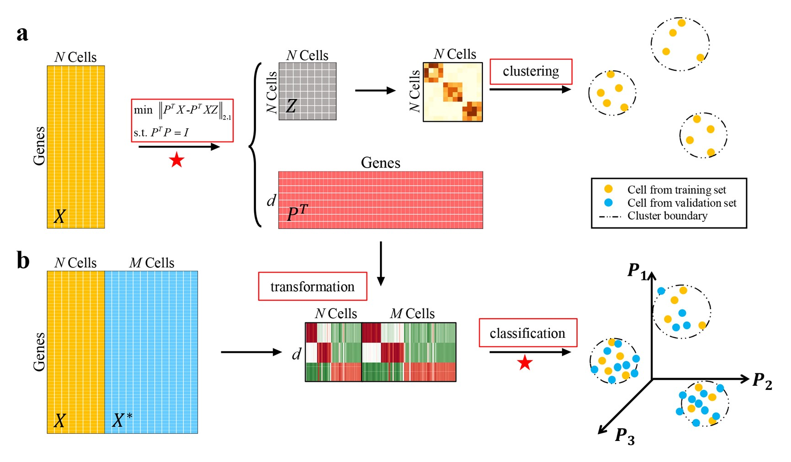

# scDA: Single cell discriminant analysis for single-cell RNA sequencing data

## Abstract

Single-cell RNA-sequencing (scRNA-seq) techniques provide unprecedented opportunities to investigate phenotypic and molecular heterogeneity in complex biological systems. However, profiling massive amounts of cells brings great computational challenges to accurately and efficiently characterize diverse cell populations. Single cell discriminant analysis (scDA) solves this problem by simultaneously identifying cell groups and discriminant metagenes based on the construction of cell-by-cell representation graph, and then using them to annotate unlabeled cells in data. We demonstrate scDA is effective to determine cell types, revealing the overall variabilities between cells from ten data sets. scDA also outperforms several state-of-the-art methods when inferring the labels of new samples. In particular, we found scDA less sensitive to drop-out events and capable to label a mass of cells within or across datasets after learning even from a small set of data. The scDA approach offers a new way to efficiently analyze scRNA-seq profiles of large size or from different batches.

## MATLAB version dependency

- Bioinformatics Toolbox

- Statistics and Machine Learning Toolbox

- [PROPACK](http://sun.stanford.edu/~rmunk/PROPACK/) (optional)

## Python version dependency

- python>=3.7
- pytorch>=1.6.0
- torchvision>=0.8.1
- numpy>=1.19.2
- scikit-learn>=0.23.2
- scipy>=1.3.2
- python-igraph>=0.8.3
- leidenalg>=0.7.0 

